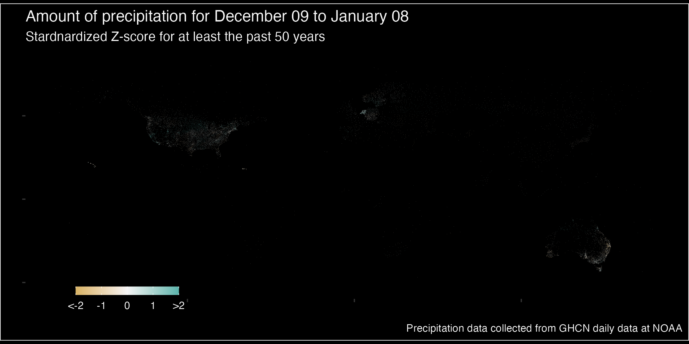

---
output:
  html_document: default
title: Drought index for world
author: Xiaohui
email_address: xiaohuimed@gmail.com
github_repo: https://github.com/BDXH-FY24/CC246
editor_options: 
  chunk_output_type: console
---

```{r echo = FALSE, message=FALSE}
library(lubridate)
```

```{css echo = FALSE}
.author, .tilte {
    display: none;
}

.main-container {
  max-width: 100%;
}

body {
    background-color: black;
    color: #f5f5f5;
    font-size: 1.2vw;
    
}


```




last update on `r today()`   
site [developed](`r rmarkdown::metadata$github_repo`) by [XiaoHui](`r rmarkdown::metadata$email_address`)

